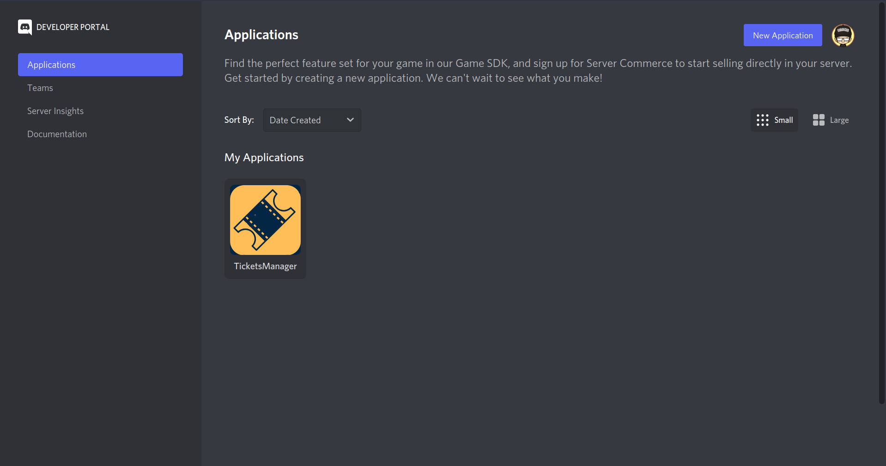
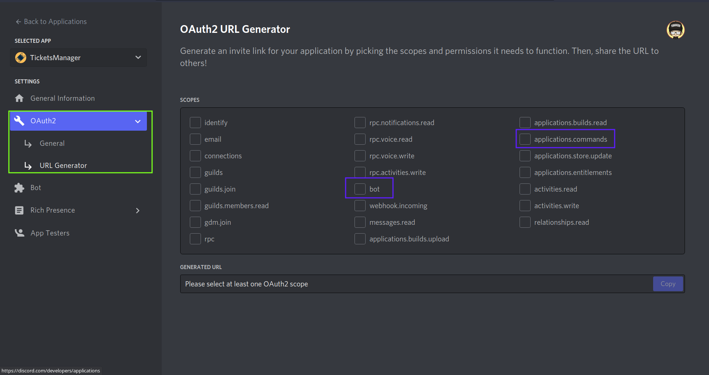

# Frequently Asked Questions

## SlashCommands not being created.
This can happen due to various factors. Make sure to check the console for any type of errors which can help you in identifying the cause for it, these are the most common ways to fix it.

- Make sure that if the slashCommand is a guild command then the `Guild ID` provided is correct and the bot is in it and have required permissions.

- Possible host issue (Lag or ratelimits).

- Make sure you invited your bot with the `application.commands` scope.
    - You can do so by following these steps.
       - Go to [Discord Developer Portal](https://discord.com/developers/applications) 
 
       - Choose the bot.
       - Goto `OAuth2` and then `URL Generator`.
       - Then click `application.commands` and `bot` scopes.
 
       - Then just click the bot permissions you need and copy the generated URL and you're done.